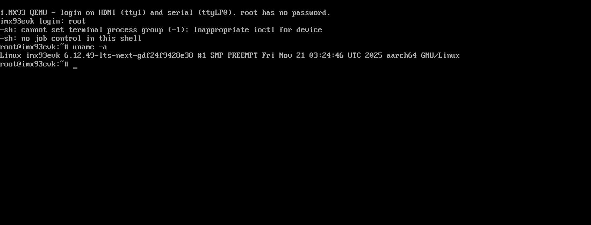

# qemu-imx93

A QEMU machine type for the NXP **i.MX 93** SoC, targeting the **11×11 EVK**
(LPDDR4X) variant.

> **This is a fork of QEMU mainline.** The i.MX 93 work lives on the
> `imx93-dev` branch (the repository default and the upstream candidate), from
> its tip back to the upstream branch point `edcc429e9e`; the vast majority of
> the history is inherited from upstream QEMU. A `main` branch pins that
> upstream base, so `git diff main...imx93-dev` shows exactly the port. The
> upstream QEMU README is preserved at [`README.rst`](README.rst) — this file
> describes the i.MX 93-specific work.

qemu-imx93 is the **first QEMU model of the i.MX 93**. It boots stock NXP BSP
Linux to userspace on the dual Cortex-A55 cluster, with networking, storage,
GPIO/PMIC, the EdgeLock Enclave mailbox, and a complete **LCDIFv3 → MIPI-DSI →
ADV7535 → HDMI** display pipeline you can log into and type on. Intended use
cases are BSP development, peripheral-driver development, and CI for the above.
It is not cycle-accurate.

Unlike the i.MX 95, the **i.MX 93 has no System Manager** — Linux programs the
CCM / ANATOP / SRC / power domains directly, so those blocks are modelled
functionally here rather than served by an M33 firmware over SCMI. Structural
conventions follow the upstream i.MX 8MP code (`hw/arm/fsl-imx8mp.{c,h}`); the
long-term aim is to be upstream-mergeable into QEMU mainline.

**Maintainer:** Kyle Fox ([@kylefoxaustin](https://github.com/kylefoxaustin))


*Real NXP BSP Linux scanned out at 1920×1080 by the emulated LCDIFv3, over the
DSI → ADV7535 → HDMI chain, on the stock EVK device tree. Two Tux logos = two
Cortex-A55 cores.*

## Quickstart for newcomers

This fork **builds and runs as-is** — a plain clone lands on `imx93-dev`.

**1. Clone and build** — a standard QEMU build (see [Building](#building) for
host packages):

    git clone https://github.com/kylefoxaustin/qemu-imx93.git
    cd qemu-imx93
    mkdir build && cd build
    ../configure --target-list=aarch64-softmmu
    ninja qemu-system-aarch64
    ./qemu-system-aarch64 -M help | grep imx93     # -> imx93-11x11-evk

**2. First boot in seconds — no external artifacts.** A bare-metal LPUART
"hello" proves the machine + console without downloading anything from NXP
(needs an `aarch64-linux-gnu` bare-metal toolchain):

    cd tests/hello-imx93 && make && cd ../..
    ./build/qemu-system-aarch64 -M imx93-11x11-evk -nographic -m 2G \
        -kernel tests/hello-imx93/hello.bin      # -> "Hello from i.MX 93!"

**3. The full stack — Linux to userspace.** Booting Linux needs a kernel
`Image`, the `imx93-11x11-evk.dtb`, and a root filesystem, all built from the
NXP BSP (not redistributable, so not in the repo — see
[Required artifacts](#required-artifacts)). Then `tests/boot-imx93/run.sh`
(serial console) or `tests/login-imx93/run.sh` (interactive login on the
emulated HDMI display).

## What runs today

Stock **NXP Linux 6.12.49** boots to userspace (PID 1) on both Cortex-A55
cores, on the **stock `imx93-11x11-evk` device tree — no DT modifications**.

- **SMP boot** of both A55 cores to userspace, **serial console** on `ttyLP0`,
  clean **PSCI power-off**.
- **Networking — both NICs live with DHCP.** FEC (`eth0`, reuses
  `hw/net/imx_fec.c`) and a from-scratch eQOS/dwmac4 (`eth1`,
  `hw/net/imx93_dwmac.c`).
- **Storage** — SD/MMC via uSDHC from `-drive if=sd`; mounts a real ext4 image
  (`mmcblk0`).
- **Clocks / power** — CCM clock roots+gates, ANATOP fractional-N PLLs, the
  MEDIAMIX power domain (genpd) and block-control GPR.
- **I²C + PMIC** — LPI2C master with the board's PCA9451A PMIC and PCAL6524
  I/O expander; regulators register and unblock uSDHC.
- **GPIO** controllers; **ELE** (EdgeLock Enclave) s4 MU + responder, so the
  OCOTP MAC nvmem cells resolve.
- **eDMA3** (`hw/dma/imx93_edma.c`) — real TCD execution (drives the LPI2C
  EDID read, among others).
- **Display — full HDMI pipeline.** The LCDIFv3 controller scans a framebuffer
  out of guest DRAM; a dw-mipi-dsi host + an ADV7535 HDMI bridge (with a
  generated EDID served over I²C-DDC) satisfy the DRM stack, which sets a
  1920×1080 mode and brings up `/dev/fb0`. fbcon renders the console on the
  emulated display.
- **Display — LVDS panel too.** Booting the `…-boe-wxga-lvds-panel` DTB lights
  the second display path, LCDIFv3 → LDB → LVDS-PHY → a fixed `boe` panel at
  1280×800 (no EDID; the panel mode is fixed). Needs the adp5585 I/O expander
  (modelled) for the panel's backlight.
- **Input + interactive login.** virtio-mmio transports + a virtio-keyboard
  (and tablet) let you **type in the QEMU window** onto the HDMI console; root
  logs in (the BSP image's root has no password) on both the framebuffer
  console and serial.



*Logging in as `root` and running `uname -a` — typed on the keyboard, rendered
on the emulated display.*

## Roadmap

The networking, storage, and the full **display (HDMI + LVDS) + input** stack
are **done** and described under "What runs today" above. What remains is
forward-looking:

| Feature | What | Target |
|---|---|---|
| **Wayland desktop** | Weston on the display output (keyboard + tablet are already wired); software/pixman render, as the i.MX 93 has no 3D GPU | **next** |
| Camera capture | MIPI CSI + ISI as a V4L2 source | deferred |
| Audio | SAI / MICFIL (PDM mic) datapaths | deferred |
| FlexCAN | FlexCAN controllers on QEMU's CAN bus (a from-scratch model exists in the i.MX 95 tree to port) | deferred |
| USB host | ChipIdea USB host so real USB devices (incl. HID) attach | deferred |
| Ethos-U65 microNPU | A functional model to replace the probe-time stub | deferred |
| Upstreaming | Submit the machine (+ any generic-QEMU prereqs) to qemu-devel | longer-term |

None of the deferred rows is a fidelity compromise in the modelled hardware —
they are unmodelled blocks that currently sit as logging stubs.

## Required artifacts

To boot Linux to userspace you need three artifacts, all built from the
[NXP i.MX Yocto BSP](https://github.com/nxp-imx/meta-imx) (`MACHINE=imx93evk`):

| Artifact | Where from |
| --- | --- |
| Kernel `Image`            | `linux-imx`, imx defconfig (the BSP kernel) |
| `imx93-11x11-evk.dtb`     | same kernel build |
| initramfs / rootfs        | any aarch64 rootfs with `/init` (e.g. the BSP `imx-image-core`) |

The `tests/*/run.sh` scripts take `KERNEL=`, `DTB=`, `INITRD=` (and `QEMU=`)
env vars and print exactly which to set if an artifact is missing.

## Quick start

Build (see [Building](#building)), then boot Linux to a serial console:

```
./build/qemu-system-aarch64 -M imx93-11x11-evk -m 4G -display none \
    -kernel <Image> -dtb <imx93-11x11-evk.dtb> -initrd <rootfs.cpio.gz> \
    -append "earlycon=lpuart32,mmio32,0x44380010 console=ttyLP0,115200 cpuidle.off=1 rdinit=/init" \
    -serial mon:stdio -serial null
```

Two cmdline details are load-bearing:

- **earlycon address `0x44380010`, not `0x44380000`.** The i.MX LPUART has
  VERID/PARAM/GLOBAL/PINCFG at 0x00–0x0C and BAUD at 0x10. Linux's regular
  driver applies the `reg_off = 0x10` offset to the DT base automatically;
  earlycon does not, so the cmdline address must be pre-offset.
- **`cpuidle.off=1`** is the conservative first-boot default (avoids the
  GICv3 WakeRequest gap shared by all GICv3 QEMU machines).

To see it on the **emulated HDMI display** and type into it, use
`tests/login-imx93/run.sh` (opens a GTK window; it routes the console to the
framebuffer, adds a virtio-keyboard, and runs a getty on `tty1`). Attach an SD
card with `-drive if=sd,file=disk.img,format=raw`.

## Known limitations

- **`fsl-se … Failed to read tamper status` is benign.** The ELE itself
  registers fine (`ele-trng`, `hsm0` configured). The tamper read is an NXP SiP
  SMC (`IMX_SIP_BBSM`) normally serviced by TF-A; a `-kernel` boot has no secure
  firmware, so it returns an error. Cosmetic only — not an ELE MU defect.
- **First-boot time is dominated by initramfs decompression under TCG.** A
  ~430 MB rootfs unpacks to ~1.3 GB tmpfs (~12 s on this host, logged as the
  gap before `Freeing initrd memory`); a small busybox initramfs boots far
  faster. Not a hang.
- **No 3D GPU on silicon.** The i.MX 93 has 2D PXP but no 3D GPU; the
  **Ethos-U65 microNPU** is a probe-time stub. A Wayland desktop will use
  software rendering.
- **USB is a logging stub** — no host controller, so no USB devices yet.
- **adp5585 I/O expander (0x34) is not modelled**, so a few board rails
  (audio/CAN/LCD power) stay in deferred-probe — non-fatal.
- On the framebuffer console, the shell prints a cosmetic
  `cannot set terminal process group / no job control` (controlling-tty quirk);
  commands run fine.
- Not cycle-accurate (TCG); no silicon timing is implied by any throughput.

## Architecture overview

- **2× Cortex-A55** (GICv3 / GIC-600, no ITS in the base SoC), the application
  cores running Linux. DDR at `0x8000_0000`.
- **No System Manager.** Unlike the i.MX 95, there is no M33 SM firmware and no
  SCMI indirection — Linux drives CCM/ANATOP/SRC/power-domains directly, and
  those are modelled functionally.
- Real device models for everything the boot + display exercise: LPUART, CCM,
  ANATOP, MEDIAMIX (blk-ctrl GPR + SRC power slice), PXP, ELE MU, LPI2C +
  PMICs, GPIO, uSDHC, FEC + eQOS, eDMA3, LCDIFv3 + DSI + ADV7535, and
  virtio-mmio for input. Everything else is a logging stub.
- The NXP BSP uses its **downstream `drm/imx` drivers** (`DRM_IMX_LCDIFV3`,
  `dw-mipi-dsi`, `adv7511`), not the mainline `mxsfb`/`imx` ones — worth knowing
  when comparing register behaviour against upstream Linux.

All memory-map addresses and IRQ numbers come from the NXP BSP (the
`imx93.dtsi`), never guessed; the Reference Manual is authoritative for register
behaviour.

## Repository tour

| Path | Purpose |
| --- | --- |
| `hw/arm/fsl-imx93.c`, `include/hw/arm/fsl-imx93.h` | SoC realization: CPUs, GIC, device wiring, memory map, virtio-mmio, logging stubs |
| `hw/arm/imx93-evk.c`        | 11×11 EVK board file (SD attach, DTB virtio node injection) |
| `hw/char/imx_lpuart.c`      | LPUART model (console) |
| `hw/misc/imx93_ccm.c`, `hw/misc/imx93_anatop.c` | CCM clock roots/gates; ANATOP PLLs |
| `hw/misc/imx93_media_blk.c` | MEDIAMIX block-ctrl GPR + SRC power-domain slice |
| `hw/misc/imx93_pxp.c`, `hw/misc/imx93_ele.c` | PXP reset model; ELE (EdgeLock Enclave) MU + responder |
| `hw/i2c/imx_lpi2c.c`        | LPI2C master (bridges to QEMU I2C bus) |
| `hw/gpio/imx93_gpio.c`      | GPIO controllers |
| `hw/net/imx93_dwmac.c`      | eQOS dwmac4 Ethernet (from scratch) |
| `hw/dma/imx93_edma.c`       | eDMA3 controller (TCD execution) |
| `hw/display/imx93_lcdif.c`  | LCDIFv3 display controller + framebuffer scanout |
| `hw/display/imx93_dsi.c`    | MIPI-DSI host (dw-mipi-dsi core) |
| `hw/display/adv7535.c`      | ADV7535 DSI-to-HDMI bridge (I²C) |
| `tests/hello-imx93/`        | bare-metal LPUART hello (no artifacts needed) |
| `tests/boot-imx93/run.sh`   | boot Linux to the serial console |
| `tests/login-imx93/run.sh`  | interactive login on the emulated HDMI display |
| `tests/poweroff-imx93/`     | static PSCI power-off helper |

## Building

    mkdir -p build && cd build
    ../configure --target-list=aarch64-softmmu
    ninja qemu-system-aarch64

**Host packages (Ubuntu 22.04+).** The QEMU build plus the tests:

    sudo apt install -y \
        meson ninja-build python3 python3-venv python3-tomli \
        gcc libc6-dev pkg-config libglib2.0-dev libpixman-1-dev \
        libgtk-3-dev \
        binutils-aarch64-linux-gnu gcc-aarch64-linux-gnu

- `meson … libpixman-1-dev` — the QEMU build itself.
- `libgtk-3-dev` — the `-display gtk` window (for the interactive HDMI login).
- `binutils/gcc-aarch64-linux-gnu` — the bare-metal hello + a static initramfs.

## Smoke tests

    # machine registers
    ./build/qemu-system-aarch64 -M help | grep imx93

    # bare-metal hello (no artifacts needed)
    cd tests/hello-imx93 && make && cd ../..
    ./build/qemu-system-aarch64 -M imx93-11x11-evk -nographic -m 2G \
        -kernel tests/hello-imx93/hello.bin      # -> "Hello from i.MX 93!"

    # Linux to userspace (needs the BSP artifacts)
    KERNEL=<Image> DTB=<dtb> INITRD=<rootfs> tests/boot-imx93/run.sh

    # interactive login on the emulated HDMI display
    KERNEL=<Image> DTB=<dtb> BASE_INITRD=<rootfs> tests/login-imx93/run.sh

## Methodology

Bring-up is measure-first ("Path-C triage"): boot real Linux, read the exact
external abort / hang, map or model that peripheral, repeat. Every address and
IRQ comes from the NXP DTS/RM, never guessed. The display milestone is a good
example — the HDMI pipeline *bound* but produced no modes; tracing it
(`drm.debug`) surfaced `i2c-0: I/O Error in DMA Data Transfer`, revealing that
the i.MX LPI2C routes its EDID read through eDMA, which had to be modelled
before the EDID could be read and a mode set.

## Milestone history

- **v0.0.1–0.0.3** — scaffold (real memory map from the DTS, GICv3, DDR,
  logging stubs); `imx.lpuart` console; CCM + ANATOP.
- **Boot to userspace** — secondary-CPU MPIDR fix, MU/LPUART map, PXP
  soft-reset model; both A55s reach `/init`.
- **Power-off + storage** — the SDHCI `SDCLK_AUTO_GATE` quirk and real uSDHC,
  so guest `poweroff` reaches PSCI and SD images mount.
- **Networking** — FEC + OCOTP wiring; the ELE MU responder (OCOTP MAC nvmem
  resolves); LPI2C + PMIC (PCA9451A) + PCAL6524 → live FEC DHCP; a from-scratch
  eQOS/dwmac4 → second NIC (`eth1`) DHCP.
- **GPIO + PMIC** — GPIO controllers and PMIC vsel presets for a clean probe.
- **Display** — LCDIFv3 + dw-mipi-dsi + ADV7535 + MEDIAMIX + eDMA3 → real
  1920×1080 HDMI scanout of the framebuffer; the dual-A55 SMP Tux logos.
- **Interactive login + input** — serial + HDMI-framebuffer login; virtio-mmio
  + virtio-keyboard/tablet so you can type in the QEMU window onto the display.

## License & credits

GPL-2.0-or-later, same as QEMU. Based on upstream QEMU; see
[`README.rst`](README.rst) and `LICENSE` for QEMU's own authorship and
licensing.

---

**Created and maintained by Kyle Fox — [@kylefoxaustin](https://github.com/kylefoxaustin).**
The first-ever QEMU port of the NXP i.MX 93.
