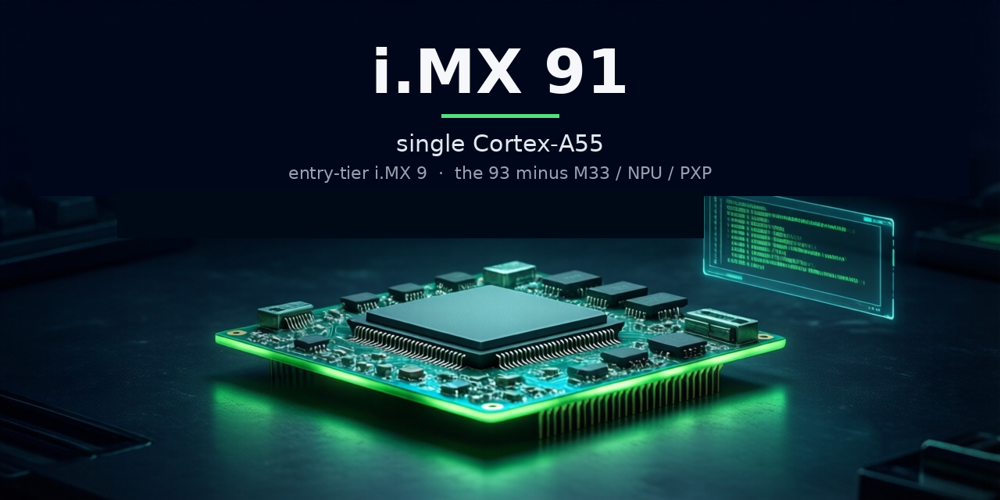

# qemu-imx91

A QEMU machine type for the NXP **i.MX 91** SoC, targeting the **11×11 EVK**
(LPDDR4) variant.

> **This is a fork of QEMU mainline**, derived from the
> [qemu-imx93](https://github.com/kylefoxaustin/qemu-imx93) port. The i.MX 91
> work lives on the `imx91-dev` branch; the bulk of the history is the i.MX 93
> port and, beneath it, upstream QEMU. The upstream QEMU README is preserved at
> [`README.rst`](README.rst) — this file describes the i.MX 91-specific work.

qemu-imx91 is the **first QEMU model of the i.MX 91**, and one node in a fleet of
NXP QEMU ports (i.MX 91 / 93 / 95 and the MCXN947 microcontroller) that share
device models and a validation standard. The i.MX 91 is a **subset of the i.MX 93**
(NXP AN14012 / AN14561): a **single Cortex-A55** — no second A55, no Cortex-M33,
no Ethos-U65 NPU, no PXP 2D engine, no MIPI-DSI / MIPI-CSI / LVDS (the display is
**LCDIF parallel RGB** only, the camera the parallel path). So this machine is the
i.MX 93 port with those blocks subtracted and the SoC retargeted to the 91's
single-core topology. It is not cycle-accurate.

It boots stock **NXP BSP Linux to userspace** on the single Cortex-A55 — and a
**vanilla mainline kernel** on the mainline `imx91-11x11-evk` device tree (i.MX 91
support landed upstream in v6.18), a fully-OSS boot that doubles as the upstream CI
functional test. Beyond booting, it passes real data between instances over six
board buses and joins a multi-node broadcast-segment lab (see
[Interconnect](#interconnect--board-to-board-mission-5)). Intended
use: BSP development, peripheral-driver development, multi-board lab work, and CI;
the long-term aim is upstream-mergeability into QEMU mainline.

**Maintainer:** Kyle Fox ([@kylefoxaustin](https://github.com/kylefoxaustin))

*Part of a consistent hero-image family across the QEMU fleet — solid silicon for
the emulator repos, one accent per node (i.MX 91 green).*

*The Linux kernel boot logo — one Tux for the single Cortex-A55 — scanned out at
800×480 by the emulated LCDIFv3 over the parallel-RGB path on the stock
`imx91-11x11-evk-tianma-wvga-panel` device tree, captured via QMP screendump.*

## Quickstart

This fork **builds and runs as-is** — a plain clone lands on `imx91-dev`.

**1. Clone and build** (host packages under [Building](#building)):

    git clone https://github.com/kylefoxaustin/qemu-imx91.git
    cd qemu-imx91
    mkdir build && cd build
    ../configure --target-list=aarch64-softmmu
    ninja qemu-system-aarch64
    ./qemu-system-aarch64 -M help | grep imx91     # -> imx91-11x11-evk

**2. Boot Linux to userspace.** You need a kernel `Image`, the
`imx91-11x11-evk.dtb`, and a rootfs — from the NXP BSP or fully-OSS mainline (see
[Required artifacts](#required-artifacts)). The easy path is
`tests/boot-imx91/run.sh`; the equivalent manual invocation:

    ./build/qemu-system-aarch64 -M imx91-11x11-evk -m 4G -display none \
        -kernel <Image> -dtb <imx91-11x11-evk.dtb> -initrd <rootfs.cpio.gz> \
        -append "earlycon=lpuart32,mmio32,0x44380010 console=ttyLP0,115200 cpuidle.off=1 rdinit=/init" \
        -nic user -nic user -serial mon:stdio -serial null

Three details are load-bearing:

- **The i.MX 91 is single-core** — `-smp 1` (the default), no flag needed. The
  second A55 and the i.MX 93's Cortex-M33 are absent.
- **earlycon address `0x44380010`, not `0x44380000`.** The LPUART has
  VERID/PARAM/GLOBAL/PINCFG at 0x00–0x0C and BAUD at 0x10; Linux's driver applies
  the `reg_off = 0x10` automatically, but earlycon does not, so the cmdline
  address must be pre-offset.
- **`cpuidle.off=1`** is the conservative first-boot default (avoids the GICv3
  WakeRequest gap shared by all GICv3 QEMU machines).

`-nic user -nic user` gives the FEC and ENET_QoS a host backend (a bare `-netdev`
leaves them unconnected). For the display, boot the
`imx91-11x11-evk-tianma-wvga-panel.dtb` variant (the base EVK dtb has no panel).

## What runs today

Stock **NXP Linux 6.12.49** boots to userspace on the single Cortex-A55, on the
**stock `imx91-11x11-evk` device tree** (with one board-side dtb fix-up, see
[Known limitations](#known-limitations)). This table is the condensed capability
view; the per-IP-block evidence, with the same **Tier / N-A** language, lives in
[`docs/validation/test-result-matrix.md`](docs/validation/test-result-matrix.md)
(one source of truth, `test-matrix.yaml`, two renderings). Tiers (the shared farm
vocabulary, so a tier means the same across boards): **A** data-path verified
(real data moves, integrity-checked) · **B** driver bring-up (binds,
registers/IRQ/timing correct, compute stubbed) · **C** present but
proprietary/out-of-scope compute (GPU/VPU/NPU) · **N/A** absent on i.MX 91 silicon
(never a failure). The entry-tier i.MX 91 has **no tier-C blocks** — its
proprietary-compute IP (NPU/GPU/VPU) is simply absent, so it lands in N/A, not C.

<!-- BEGIN capability-table (generated from test-matrix.yaml) -->
| Subsystem | Tier | Evidence |
|---|:--:|---|
| Cortex-A55 boot (nproc=1), GICv3 | A | Boots Linux to a shell on ttyLP0; SiP GET_SOC_INFO reports soc_id=i.MX91, rev 1.0 |
| Networking — FEC (eth0) + ENET_QoS/dwmac4 (eth1) | A | Both DHCP; real frames |
| Storage — uSDHC x3 | A | SDHCI ADMA moves real block data; ext4 mmcblk0 r/w/sync |
| eDMA1/2 | A | Real TCD execution - I2C transfers, audio FIFO drains, per-CH_MUX source-id routing |
| Serial console — LPUART x8 | A | Console I/O on ttyLP0; LPUART2 drives the UART interconnect |
| Audio — SAI/MICFIL/XCVR (play + capture) | A | Square wave -> eDMA -> wav byte-checked at 48k & 16k (rate from the codec, not assumed); SAI/MICFIL capture real samples; concurrent multi-stream |
| Camera — MT9M114 -> parallel-CSI -> ISI -> V4L2 | A | 5/5 byte-checked 1280x720 YUYV frames off /dev/video0; host-file frame injection |
| FlexSPI1 (NOR + SPI-NAND) | A | Boots from real flash contents; JEDEC + read verified |
| FlexCAN x2 | A | can0 up; frame round-trip; board-to-board (see Interconnect) |
| LPSPI x8 | A | Per-bus SSI master; is25lp064 JEDEC byte-exact; drives board-to-board SPI |
| I2C — LPI2C x8 + FlexIO-as-I2C | A | Codec answers; -device tmp105,bus=... enumerated + read; FlexIO shift-race fixed; drives I2C interconnect |
| I3C1 (Silvaco) | A | I3C master bridges to legacy I2C; wm8962-on-I3C audio card registers |
| Display — LCDIFv3 parallel-RGB | B | imx-drm binds, 800x480 /dev/fb0, framebuffer DMA'd out + screendump byte-correct |
| ChipIdea USB host (ci_hdrc) | B | usb-storage -> /dev/sda byte-correct; usbredir host (see Interconnect) |
| Clocks/power — CCM / ANATOP / SRC | B | Linux programs directly (no System Manager) |
| ELE (EdgeLock Enclave, MU) | B | Driver binds; honest-fault rail (ele-uncomputed-cmds counter + opt-in guest fault) |
| Timers + control — TPM, SYSCTR, WDOG, SEMA42, MU1/2, GPIO, BBNSM, DDRC | B | Drivers bind; registers/IRQ/timing correct |
| Sensors/analog — TMU, ADC1, OCOTP | B | Driver binds; ADC carries operator-settable adc-chN props; TMU settable temperature |
| I2C peripherals — WM8962, MT9M114, PMIC/expanders | B | Codec/sensor/PMIC answer on their LPI2C buses (I2C regdev); PMIC reports real OTP rail voltages, guest-verified |

**Absent on i.MX 91 silicon — N/A (never a failure):**

| Block | Why absent |
|---|---|
| Ethos-U65 NPU · 2nd Cortex-A55 · Cortex-M33 (+ MU peer) | Not on the i.MX 91 (the i.MX 93 has them) |
| System Manager (SM/SCMI) | i.MX 91/93 have none; Linux programs CCM/ANATOP/SRC directly |
| PXP 2D engine · MIPI-DSI · MIPI-CSI · LVDS · ADV7535 HDMI bridge | Not present - display is parallel-RGB LCDIF, camera is parallel ISI |
<!-- END capability-table (generated from test-matrix.yaml) -->

**SoC identity is correct.** Linux reads the chip id from the SiP SoC-info SMC
(`fsl_imx91_sip_handler`), which returns `0xa0009100` → id `0x91`, rev 1.0 (A0);
no i.MX 93 `0x9300` artifact remains. It also **runs the BSP's ~100 variant DTBs**
(other boards, per-peripheral cards) to userspace — a catch-all region keeps a
hand-edited DTB poking an unmodeled address from data-aborting.

## Interconnect — board-to-board (mission #5)

Beyond running on one board, the i.MX 91 **passes real data between QEMU
instances** over its buses, in the per-link socket shape a lab coordinator
([holobench](https://github.com/kylefoxaustin/holobench)) wires — so two emulated
boards hook up over a stock QEMU socket, no host kernel/root. Every link has a
byte-exact oracle. Harness:
[`tests/interconnect-imx91/`](tests/interconnect-imx91/).

| Transport | Shape | Status |
|---|---|:--:|
| **Ethernet** | two 91s, FEC `eth0` over `-nic socket` | PASS |
| **UART** | two 91s, LPUART2 `/dev/ttyLP1` over `-chardev socket` | PASS |
| **SPI** | two 91s, LPSPI1 `/dev/spidev0.0` via the **`spi-link`** device over `-chardev socket` | PASS |
| **CAN** | two 91s, FlexCAN `can0` via **`can-host-chardev`** over `-chardev socket` | PASS |
| **USB (bulk)** | 91 as usbredir host ↔ an MCXN947 gadget; EP1 bulk-echo byte-exact | PASS |
| **USB-CDC (serial)** | 91 `cdc_acm` ↔ MCX CDC gadget → `/dev/ttyACM0` serial round-trip | PASS |
| **I²C** | two 91s, LPI2C3 masters ↔ an **`i2c-link`** target at `0x42` over `-chardev socket` | PASS |

Several transports use **shared chardev-bridge devices**, pooled across the fleet:
`spi-link` (`hw/ssi/spi_link.c`, originated here — an SSI peripheral bridging an
SPI bus to a chardev; non-blocking tx so a continuous clock can't hang the vCPU),
`can-host-chardev` (`net/can/can_host_chardev.c`, carried from the i.MX 95 — a
can-bus↔chardev bridge, no host vcan/root), and `i2c-link` (`hw/i2c/i2c_link.c`,
carried from the i.MX 93 — an I²C target bridging a bus to a chardev). Bringing SPI
up also drove out two `imx93_lpspi` model fixes the register qtest had passed over
(`PARAM.PCSNUM` and per-frame `FCF` — without them the real `fsl-lpspi` driver
couldn't register a controller).

**Cross-SoC validated.** `spi_link.c` and `can-host-chardev` are proven byte-exact
across **i.MX 91 / 93 / 95 / MCXN947** — PIO↔eDMA masters and Linux↔bare-metal-M33
— so any two boards interoperate. The USB-CDC link means a developer can **PuTTY
into the emulated 91 over `/dev/ttyACM`**, and the board is otherwise reachable
exactly like a real EVK: `serial-getty` login on `ttyLP0` and `ssh` over eQOS
([`tests/putty-imx91/`](tests/putty-imx91/)).

**Multi-node segment lab (ENET-LAB3).** Beyond point-to-point, the 91 stands up as a
Linux peer on holobench's **broadcast-segment** lab, where N nodes share one
multicast wire and each PASSes only while it can see all the others
([`tests/interconnect-imx91/run-enet-lab.sh`](tests/interconnect-imx91/) + a pinned,
config-free `enet-lab3` FEC-beacon artifact). Each frame carries a **checkable
body** — magic, a self-consistent ethertype, a monotonic sequence, a **per-boot
incarnation nonce**, and a fill pattern — and the receiver verifies it, so the lab
finds bugs an ethertype count cannot: a replayed stale ring buffer (freshness, not
validity), a node reboot vs. a replay (the nonce), an over-long or self-contradicting
frame. The node re-arms its heartbeat (a departure is a *gap*, not a silence),
ignores non-beacon traffic (IPv6 NDP on a real mixed segment), and never exits so a
coordinator-scheduled departure is distinguishable from a crash. Interoperates with
the fleet's MCX / RT1180 / i.MX 95 beacon nodes on a shared v2 wire.

## Validation

Correctness rests on **six independent gates**, not one:

1. **Kernel-free qtests** on the `imx91-11x11-evk` machine (FlexCAN, LPSPI, SAI
   TX + RX-capture, MICFIL, XCVR, LPI2C, ISI, FlexSPI, FlexIO, DDRC, I3C, WDOG,
   LPCG — async timer races use `clock_step` to pin the ordering; the WDOG test
   brackets the watchdog deadline to prove the prescaled countdown lands on the
   driver's assumed rate, and the LPCG test clears a block's clock gate and shows
   its counter freeze). CI-runnable; the matrix is
   assembled by [`tests/gen-test-matrix.py`](tests/gen-test-matrix.py), which
   reads Tier from `test-matrix.yaml` and fills the result from the run — it
   gates on any qtest regression.
2. **Reset-value oracle** — [`tests/imx91-reset-values/`](tests/imx91-reset-values/)
   probes every register at reset over qtest and diffs against a golden extracted
   from the i.MX 91 Reference Manual PDF (9,308 registers, 127/127 instances,
   width-aware). It is the **only gate whose expectations the model did not
   author**: every other check can be satisfied by the model agreeing with itself
   (a mirror), so it cannot see a value the model was written to produce — this one
   can, because the golden comes from the RM. Every deviation is either matching, a
   **decision with a stated reason**, or a declared **gap**; a shrink-only ratchet
   (`triage.py`) forbids the allowlist from growing itself. It drove out the bulk of
   the reset-value fixes (CCM `STATUS` at the wrong offset, the TMU that never
   worked, fabricated version/PARAM registers, `VEND_SPEC` truncation) and stands at
   zero un-triaged deviations.
3. **AddressSanitizer + UBSan** sweep of the shared device models (zero findings).
4. **24-hour concurrent soak** across the variant-DTB matrix (1423 boots, zero
   function failures, flat RSS) as the release gate.
5. **Vanilla-mainline boot** — a stock upstream kernel + mainline dts to userspace,
   confirming the model matches upstream (the QEMU-CI functional test).
6. **Interconnect + cross-SoC** — byte-exact board-to-board over all seven
   transports plus the multi-node segment lab, cross-validated against the i.MX 93 /
   95 / MCXN947 nodes.

The recurring lesson: a green deterministic qtest is *not* validation for a model
with no live workload — the FlexIO IRQ-storm fix and the LPSPI PARAM/FCF fixes only
proved out (or surfaced) against a real-driver repro; and a hand-written qtest that
asserts the value the model was written to return is a mirror, not an oracle (the
RM-golden reset gate exists precisely because such mirrors cannot see a fabrication).
Fidelity judgments live in
[`docs/validation/fidelity-audit.md`](docs/validation/fidelity-audit.md); the
model can also **compile and run real code in-guest on the A55**
([`tests/in-guest-build-imx91/`](tests/in-guest-build-imx91/), three levels green)
and build real third-party projects
([`tests/sweep-imx91/`](tests/sweep-imx91/)).

## Required artifacts

To boot Linux you need three artifacts, all built from the
[NXP i.MX Yocto BSP](https://github.com/nxp-imx/meta-imx) (`MACHINE=imx91evk`):

| Artifact | Where from |
| --- | --- |
| Kernel `Image` | `linux-imx`, imx defconfig |
| `imx91-11x11-evk.dtb` (or `…-tianma-wvga-panel.dtb` for display) | same kernel build |
| initramfs / rootfs | any aarch64 rootfs with `/init` (e.g. BSP `imx-image-core`) |

The `tests/*/run.sh` scripts take `KERNEL=`, `DTB=`, `INITRD=`, `QEMU=` env vars
and print exactly which to set if one is missing.

**No NXP access? A fully-OSS boot works too.** A vanilla mainline kernel (≥ v6.18,
arm64 defconfig), the mainline `imx91-11x11-evk.dtb`, and the static-aarch64
BusyBox initramfs from `tests/busybox-imx91/` boot the machine to a shell with
**zero NXP bits** — the exact tuple the upstream functional test uses.

## Building

    mkdir -p build && cd build
    ../configure --target-list=aarch64-softmmu
    ninja qemu-system-aarch64

**Host packages (Ubuntu 22.04+):**

    sudo apt install -y \
        meson ninja-build python3 python3-venv python3-tomli \
        gcc libc6-dev pkg-config libglib2.0-dev libpixman-1-dev \
        libgtk-3-dev binutils-aarch64-linux-gnu gcc-aarch64-linux-gnu

## Architecture overview

- **1× Cortex-A55** (GICv3 / GIC-600, no ITS), DDR at `0x8000_0000`. No second A55
  and no Cortex-M33 (both on the i.MX 93). No System Manager — Linux drives CCM /
  ANATOP / SRC / power domains directly (functional models, not SCMI-over-firmware).
- Real device models for everything boot/net/storage/display/I²C/audio/camera
  exercises: LPUART, CCM, ANATOP, MEDIAMIX (blk-ctrl GPR + SRC power slice), ELE
  MU, MU1 (a standalone A55-side mailbox — no M33 peer), MU2, LPI2C + PMICs, GPIO,
  uSDHC, FEC + ENET_QoS, eDMA1/2, LCDIFv3, ISI, SAI/MICFIL/XCVR/WM8962, FlexSPI,
  Silvaco I3C, DDR controller + PMU, ChipIdea USB, FlexCAN, LPSPI (+ the `spi-link`
  interconnect peripheral), and virtio-mmio. Everything else is a logging stub
  (the IOMUXC pinmux is a deliberate no-op).
- Structural conventions follow upstream `hw/arm/fsl-imx8mp.{c,h}` and the i.MX 93
  port. All memory-map addresses and IRQ numbers come from the NXP BSP
  (`imx91.dtsi` / the i.MX 91 Reference Manual), never guessed. The BSP uses its
  downstream `drm/imx` drivers; the machine also boots a vanilla mainline kernel,
  so it tracks both driver stacks.

## Repository tour

| Path | Purpose |
| --- | --- |
| `hw/arm/fsl-imx91.c`, `include/hw/arm/fsl-imx91.h` | SoC realization: single A55, GIC, device wiring, memory map (derived from fsl-imx93, 93-only blocks removed) |
| `hw/arm/imx91-evk.c` | 11×11 EVK board file (SD attach, DTB virtio-mmio + secure-enclave-IRQ injection) |
| `hw/arm/Kconfig`, `hw/arm/meson.build` | `FSL_IMX91` / `FSL_IMX91_EVK` config + build wiring |
| `hw/ssi/spi_link.c`, `net/can/can_host_chardev.c` | the board-to-board **interconnect** transports (SPI + CAN chardev bridges) |
| (shared with the i.MX 93, unchanged) | `hw/char/imx_lpuart.c`, `hw/misc/imx93_{ccm,anatop,ele,media_blk,flexio}.c`, `hw/i2c/imx_lpi2c.c`, `hw/ssi/imx93_lpspi.c`, `hw/gpio/imx93_gpio.c`, `hw/net/{imx_fec,imx93_dwmac}.c`, `hw/dma/imx93_edma.c`, `hw/display/{imx93_lcdif,imx93_isi}.c`, `hw/audio/{imx93_sai,imx93_micfil,imx93_xcvr,wm8962}.c`, `hw/net/can/flexcan.c`, ChipIdea USB |
| `tests/boot-imx91/`, `tests/functest-imx91/` | boot to console; end-to-end smoke (uSDHC r/w, I²C, both Ethernets) |
| `tests/display-imx91/`, `tests/camera-imx91/`, `tests/audio-imx91/` | LCDIF scanout, V4L2 capture, and ALSA play/capture oracles (audio checks pitch, duration, and — rate-pinned — square-wave run structure at 48k & 16k, so a scattered sample loss can't hide) |
| `tests/usdhc-imx91/`, `tests/thermal-imx91/`, `tests/clock-tree-imx91/`, `tests/flexspi-lut-imx91/` | dedicated block oracles: SD-card r/w + VEND_SPEC migration, die-temperature sweep, CCM mux/divider/gate math, FlexSPI LUT-lock |
| `tests/interconnect-imx91/` | board-to-board links: `run-{eth,uart,spi,can,usb,usb-cdc,i2c}.sh` + `run-spi-stress.sh`; the multi-node segment lab `run-enet-lab.sh` + the pinned `enet-lab3` beacon artifact |
| `tests/imx91-reset-values/` | the RM-golden reset-value oracle: `extract-rm-golden.py`, `check.py` (the gate), shrink-only `triage.py`, `known-deviations.txt` |
| `tests/putty-imx91/`, `tests/in-guest-build-imx91/`, `tests/sweep-imx91/` | developer access (serial + SSH), in-guest build (3 levels), third-party code sweep |
| `tests/qtest/imx91-*-test.c` | kernel-free qtests on the imx91-11x11-evk machine |
| `tests/soak-imx91/` | long-run soak over the variant-DTB matrix, VmRSS leak tracking, periodic qtests |
| `tests/functional/aarch64/test_imx91_evk.py` | upstream-style functional test: vanilla kernel + mainline dtb + BusyBox (all OSS), runs in QEMU CI |
| `docs/validation/` | the test-result matrix, fidelity audit, and `test-matrix.yaml` (tier source of truth) |

## Known limitations

- **Secure-enclave tamper IRQ is injected.** The stock EVK dtb's `fsl,imx93-se`
  node omits the tamper-IRQ `interrupts` property, so `fsl-se` would fail
  `platform_get_irq()` and never register — cascading to OCOTP nvmem and leaving
  the ENET_QoS MAC in deferred probe forever. The board's `modify_dtb` injects the
  two AONMIX secvio/tamper SPIs (34/35, as the i.MX 93 dtb wires them).
- **`fsl-se … Failed to read tamper status` is benign.** The ELE registers fine;
  the tamper read is a SiP SMC normally serviced by TF-A, absent in a `-kernel` boot.
- The base `imx91-11x11-evk.dtb` has no display panel — use the
  `…-tianma-wvga-panel` variant for the display.
- **LPSPI reports 4 chip-selects but does not decode `TCR.PCS` to select among
  multiple slaves on one bus** — fine for the usual one-slave-per-controller case
  (and the board-to-board link), a gap only if a board muxes several SPI devices
  on one LPSPI.
- Not cycle-accurate (TCG); no silicon timing is implied by any throughput.

## Roadmap & milestone history

The current release is **`imx91-v1.1`** — the complete, soak-validated model plus
upstream readiness — extended this cycle with the **board-to-board interconnect**
(seven transports plus the multi-node segment lab, cross-SoC validated) and a
**reset-value audit** taken to zero un-triaged deviations. What remains is **upstream submission**
(the machine + board + the three 91-only device models — DDR controller, SPI-NAND,
Silvaco I3C — as a follow-on to the i.MX 93 series). Inert RM blocks
(LPTMR/LPIT/TRGMUX/GPC/CoreSight/boot-ROM/USB-PHY) stay unmodeled until a use case
demands them.

Milestones, in order:

- **Bootstrap → chop-down** — cloned the i.MX 93 port; removed the 2nd A55, the
  Cortex-M33 (+ RPMsg/MU peer), Ethos-U65, PXP, and the MIPI-DSI/CSI + LVDS +
  ADV7535 chain; retargeted to single-core, validating boot-to-userspace at each step.
- **Functional bring-up** — storage, both Ethernets (DHCP), I²C, the EdgeLock
  enclave (the dtb tamper-IRQ fix-up), LCDIF display scanout, FlexCAN, ChipIdea USB.
- **Audio + camera** — SAI3/WM8962 + SPDIF/XCVR playback, SAI/MICFIL capture
  (drove out two eDMA bugs), concurrent multi-stream via per-CH_MUX routing, and
  the MT9M114 → ISI → V4L2 path (with host frame injection).
- **Deterministic CI + FlexIO fix** — kernel-free qtests across the machine; the
  ~1/1000 FlexIO-as-I²C IRQ-storm closed with an event-driven gate (converged
  byte-identical with the i.MX 93).
- **`imx91-v1.0`** — first complete release: a 24-hour final soak (1423 boots,
  zero failures, flat RSS) with every modeled data path validated end to end.
- **`v1.1` — upstream readiness** — the QEMU-CI functional test on a vanilla
  mainline kernel + OSS assets, the doc + MAINTAINERS entry, SAI rx-capture qtest
  fix, in-guest LCDIF soak test.
- **Interconnect (mission #5)** — ethernet / UART / SPI / CAN / I²C / USB (bulk + CDC
  serial) board-to-board, byte-exact; the new `spi-link` device (contributed to
  the fleet) and carried `can-host-chardev`; cross-validated across i.MX 91/93/95
  and MCXN947; a back-pressure hardening pass so continuous clocking can't hang.
- **Reset-value audit + fidelity hardening** — the RM-golden reset-value oracle
  ([`tests/imx91-reset-values/`](tests/imx91-reset-values/)) taken to zero
  un-triaged deviations across 9,308 registers, driving out a run of silent
  fabrications the mirror-style gates could not see: the CCM `STATUS` register at
  the wrong offset, a TMU that never worked, invented version/PARAM/capability
  values, `VEND_SPEC` truncated to 16 bits with a zero reset, a watchdog that
  wouldn't arm. Capability registers made **computed-from** the block they describe
  (a drift is now a compile error); the SAI sample rate taken from the wm8962 codec
  instead of a hardcoded 48 kHz; the PCA9451A PMIC given its real datasheet OTP rail
  voltages; SDHCI `VEND_SPEC` width/reset/migration fixed upstream-side; the
  segment-lab beacon carried to a v2 per-boot incarnation nonce; and the broken
  `imx93-evk` sibling machine un-blocked. A follow-on pass then went after the class
  the reset gate is structurally blind to — *behavioral* constants, checked against
  each block's Linux driver rather than the RM: the watchdog's prescaled countdown
  ran at 3 Hz where `fsl,imx93-wdt` assumes 125 Hz, so it fired ~42× too late (fixed,
  qtest-bracketed); and all three audio blocks that fed a fixed 48 kHz regardless of the
  programmed rate now take it from a clock — SAI from the codec, MICFIL from `pdm_root`
  (guest-verified at 48 k/16 k, which surfaced a per-channel feed bug the fixed rate had
  masked), and XCVR/SPDIF from `spdif_root` (guest-verified at 48 k/96 k). Each rate fix
  is guarded by an asserting, mutation-proven playback/capture-duration test. The clock
  tree's last gap closed with them: the CCM's **LPCG gates now reach their consumers** —
  clearing a block's gate actually stops TPM/MICFIL/XCVR rather than only flipping a
  status register while the block keeps running (qtest-proven: the counter freezes on
  gate-clear and resumes on gate-set). And the SAI play oracle itself was **tightened
  from statistical to structural** — with the wav rate pinned so the capture isn't
  resampled, every square-wave half-period is asserted frame-exact, so a scattered ~0.4 %
  sample loss that peak/tone/duration cannot feel (mutation-proven) fails the run-length
  check hard (a technique independently adopted across the i.MX 93 / 95 / RT1180 nodes).

## License & credits

GPL-2.0-or-later, same as QEMU. Derived from the qemu-imx93 fork of upstream QEMU;
see [`README.rst`](README.rst) and `LICENSE` for QEMU's own authorship and
licensing.

---

**Created and maintained by Kyle Fox — [@kylefoxaustin](https://github.com/kylefoxaustin).**
The first-ever QEMU port of the NXP i.MX 91.
